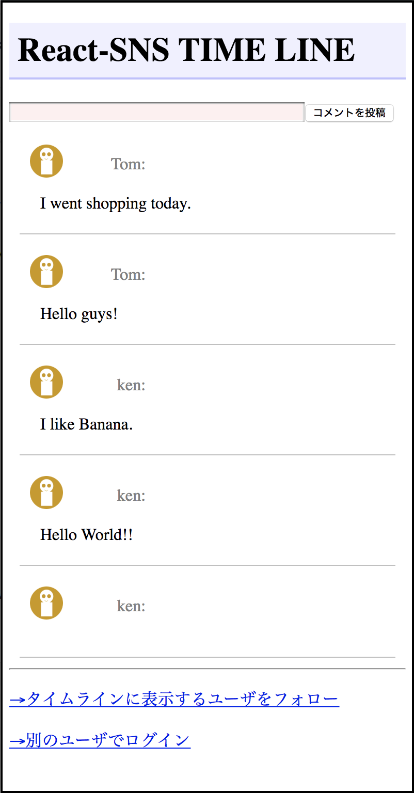
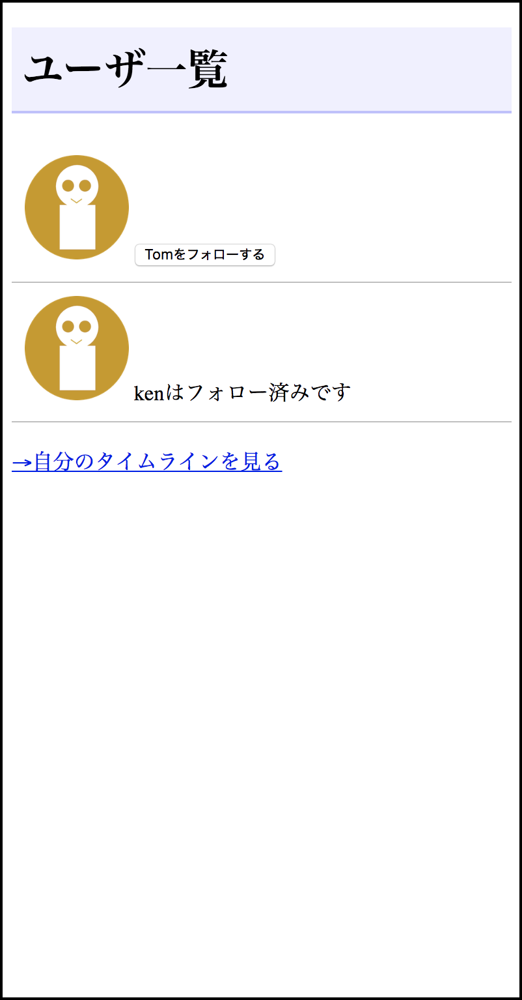
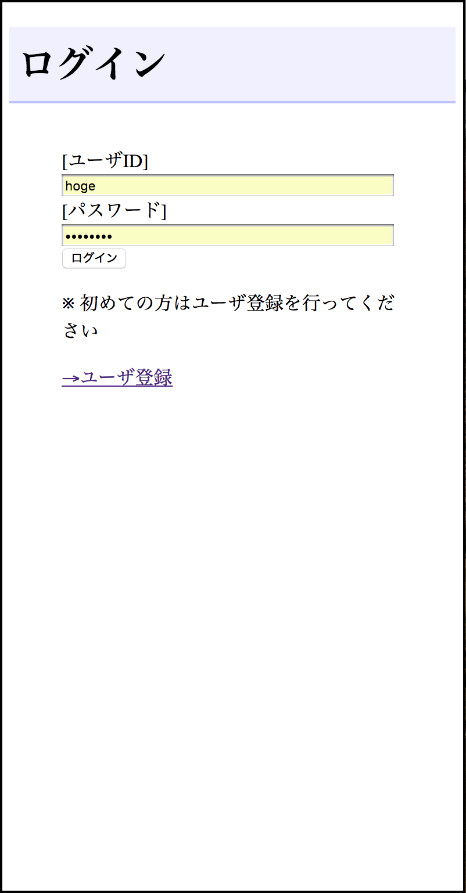

# React-SNS
This is the SNS server and client made by React. You can run this on your PC.

## Screen Shots

|Timeline|User List|Login|
|---|---|---|
||||


## How to run
```bash
cd <this repository>
npm install
npm run build
npm start
```

Then open http://localhost:3001
